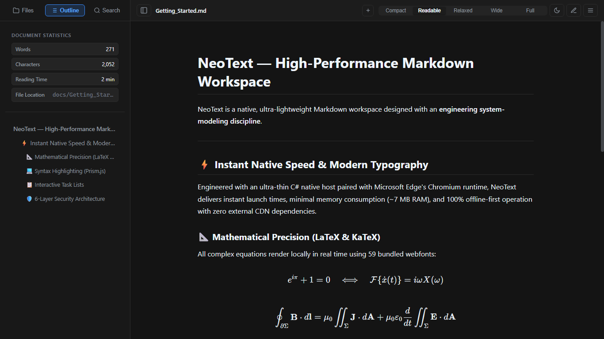
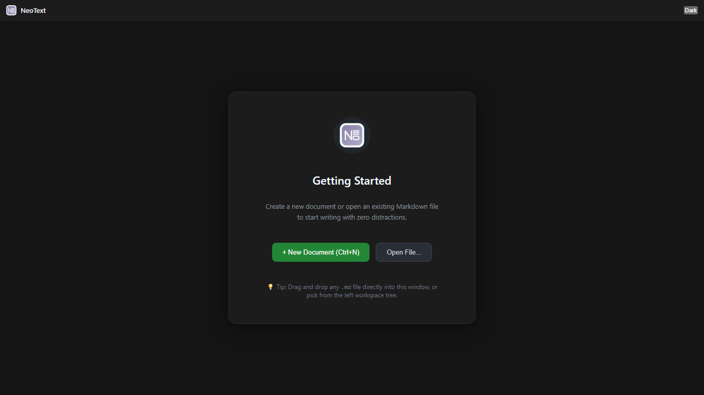
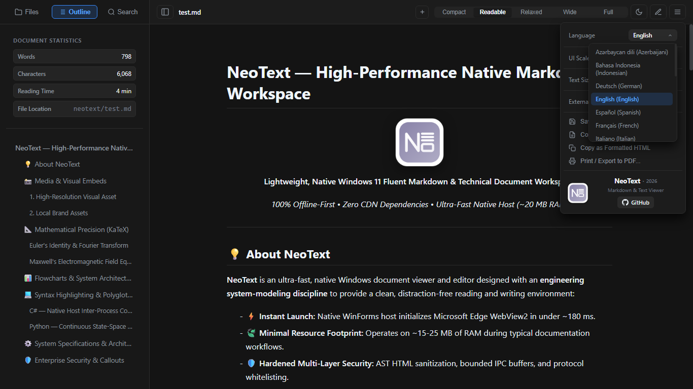
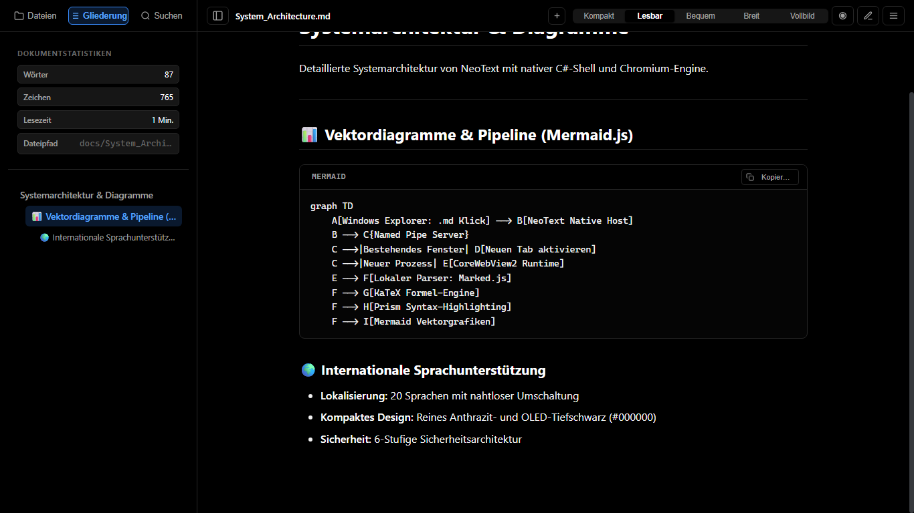
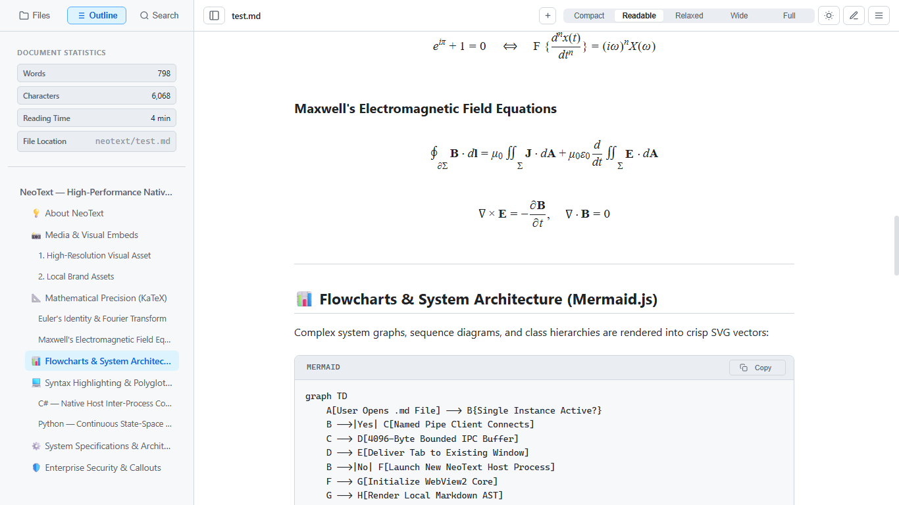
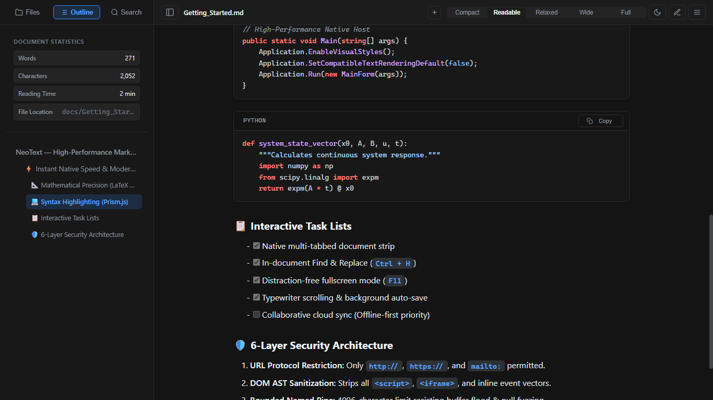

# NeoText

<div align="center">


### High-Performance Native Windows Markdown & Document Workspace

[](LICENSE)
[-0078D6.svg)](https://microsoft.com)
[](#about-the-project)
[](#key-features)
[-brightgreen.svg)](#zero-config-build--compilation)
[](https://buymeacoffee.com/atukay)
[](https://apps.microsoft.com/detail/9PG680TWN0LC)

<p align="center">
  <a href="https://apps.microsoft.com/detail/9PG680TWN0LC">
    
  </a>
</p>

[Showcase](#interface-showcase) • [Features](#key-features) • [Build & Compilation](#zero-config-build--compilation) • [Shell Integration](#running--shell-integration) • [Support](#support--sponsoring) • [License](#license--copyright)

</div>

---

## Interface Showcase

<div align="center">

### Modern Dark Workspace & Document Engine
*Native Windows 11 Fluent dark palette, bundled KaTeX LaTeX formula rendering, Prism.js syntax highlighting, and real-time outline navigation.*



<br/><br/>

| Borderless Minimalist Empty State | Multilingual Localization (20 Languages) |
| :---: | :---: |
|  |  |
| *Zero-distraction drag and drop landing screen* | *Theme-aware language dropdown with 20 native translations* |

<br/>

| OLED Pure Black & System Flowcharts | Clean Light Theme & Mathematical Rigor | Polyglot Code Highlighting & Callouts |
| :---: | :---: | :---: |
|  |  |  |
| *True #000000 black with local Mermaid.js diagrams* | *Crisp light palette with local KaTeX formula rendering* | *Prism.js syntax highlighting and GitHub-style callouts* |

</div>

---

## About The Project

NeoText is a lightweight, native Windows document viewer and editor designed with an engineering system-modeling discipline to provide an instantaneous, distraction-free environment for technical documentation.

- **Instant Launch & Minimal Footprint:** Initializes the Microsoft Edge WebView2 core in under ~180 ms and operates with a slim ~15-25 MB RAM footprint during typical workflows.
- **Embedded Chromium Power:** Utilizes the Windows native Microsoft Edge WebView2 runtime for crisp typography, modern CSS standards, and hardware-accelerated text rendering.
- **100% Offline First (Zero CDN):** All mathematical fonts, KaTeX typesetting engines, Prism.js syntax highlighters, and Mermaid.js diagramming tools are bundled locally within the application directory. No network connection is ever required.

---

## Key Features

- **Multi-Tab Workspace:** Full tab lifecycle management, horizontal mouse-wheel scrolling, tab overflow indicators, and keyboard navigation (`Ctrl+Tab`, `Ctrl+W`, `Ctrl+N`).
- **Tab Reordering & Window Tear-Off:** Smooth horizontal drag-and-drop reordering, with the ability to tear any tab off into an independent native host process for multi-monitor setups.
- **3 Native Themes:** Modern Dark (Anthracite `#1c1c1c` matching Windows 11 Fluent design), Clean Light, and energy-efficient OLED Pure Black (`#000000`).
- **Subpixel Mathematical Branding:** Vector logo geometrically aligned to subpixel coordinates, rendered across 9 resolutions (16px to 1080px) and compiled into high-DPI icons.
- **Local LaTeX Mathematics:** Complete `$inline$` and `$$display$$` formula rendering via embedded KaTeX with bundled local webfonts.
- **Polyglot Syntax Highlighting:** Syntax coloring across 20+ programming languages via Prism.js with integrated one-click clipboard copying.
- **Vector Diagramming:** Native SVG rendering for flowcharts, sequence diagrams, and system architecture graphs via Mermaid.js.
- **20-Language Internationalization (i18n):** Custom-designed, theme-aware language selector supporting English, Turkish, German, French, Spanish, Japanese, Chinese, Russian, and 12 additional languages.
- **Workspace Tree Explorer:** Hierarchical directory navigation with recursive Markdown file discovery.
- **Document Metrics & Dynamic Outline:** Real-time word count, character count, reading time estimation, and clickable H1-H6 heading navigation.
- **Hardened Security Architecture:** Strict DOM-based AST HTML sanitization eliminating script injections, bounded 4096-byte IPC buffers, protocol whitelisting (`http://`, `https://`, `mailto:`), and a >2 MB large-file guard that switches to an optimized raw viewer to maintain system responsiveness.
- **Zero-Install Portability:** Operates without registry dependencies or hardcoded paths; functions smoothly from local folders, removable USB drives, or network locations.

---

## Installation & Getting Started

### Option 1: Microsoft Store (Recommended)
NeoText is distributed via the Microsoft Store for verified MSIX sandboxing, automatic background updates, and seamless Windows shell integration:

<p align="left">
  <a href="https://apps.microsoft.com/detail/9PG680TWN0LC">
    
  </a>
</p>

* Direct Store protocol link: [`ms-windows-store://pdp/?productid=9PG680TWN0LC`](ms-windows-store://pdp/?productid=9PG680TWN0LC)

---

### Option 2: Building from Source (Zero-Config)

NeoText is also distributed as a pure, dependency-free open source codebase. Any modern Windows installation with .NET Framework 4.5 or later (pre-installed on Windows 10 and 11) can build the complete project using the native Microsoft C# Compiler (`csc.exe`).

Execute the build script from Command Prompt or PowerShell:

```cmd
build.bat
```

Or via PowerShell:

```powershell
powershell -ExecutionPolicy Bypass -File .\build.ps1
```

**Build Output:**
1. `neotext\NeoText.exe`: Primary application host executable.
2. `neotext\ConfigureShell.exe`: Windows Shell integration and file association utility.

---

## Running & Shell Integration

### Launching NeoText

```powershell
.\neotext\NeoText.exe "neotext\Introduction.md"
```

### Windows Context Menu & File Association

To associate `.md` files and add "Open with NeoText" to the Windows Explorer right-click context menu (no Administrator privileges required, registered to `HKCU`):

```powershell
.\neotext\ConfigureShell.exe
```

---

## Support & Sponsoring

NeoText is free, open-source software built with an independent engineering discipline. If NeoText streamlines your daily note-taking, markdown rendering, or documentation workflow, you can support its ongoing maintenance and development:

<div align="center">

[](https://buymeacoffee.com/atukay)

</div>

---

## License & Copyright

NeoText is free software licensed under the **GNU General Public License v3.0 (GPLv3)**.

```text
Copyright (C) 2026 The NeoText Project (atukay) <https://github.com/atukay/NeoText>

This program is free software: you can redistribute it and/or modify
it under the terms of the GNU General Public License as published by
the Free Software Foundation, either version 3 of the License, or
(at your option) any later version.

This program is distributed in the hope that it will be useful,
but WITHOUT ANY WARRANTY; without even the implied warranty of
MERCHANTABILITY or FITNESS FOR A PARTICULAR PURPOSE. See the
GNU General Public License for more details.
```

See the [LICENSE](LICENSE) file for the full GNU GPL v3 terms.

### Third-Party Software Notices
NeoText bundles components from open-source libraries:
- **Marked.js:** MIT License (Copyright (c) Christopher Jeffrey)
- **KaTeX:** MIT License (Copyright (c) Khan Academy and contributors)
- **Prism.js:** MIT License (Copyright (c) Lea Verou)
- **Mermaid.js:** MIT License (Copyright (c) Knut Sveidqvist)
- **Microsoft Edge WebView2 SDK:** Microsoft Software License (REDIST terms)

Detailed licenses and attribution notices are documented in [THIRD_PARTY_LICENSES.md](THIRD_PARTY_LICENSES.md).
