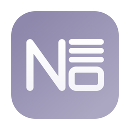
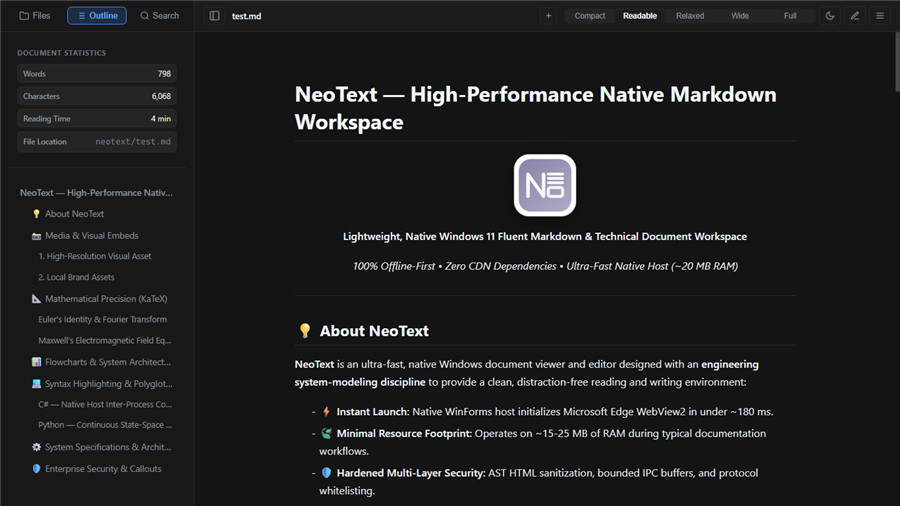
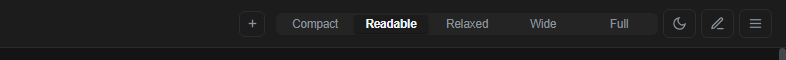
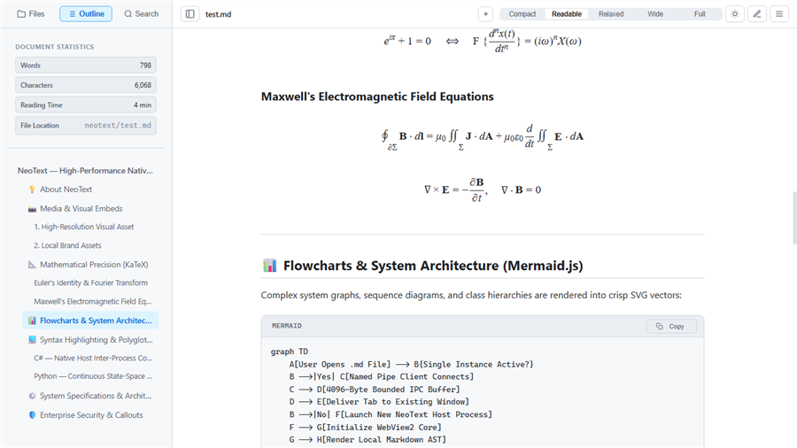
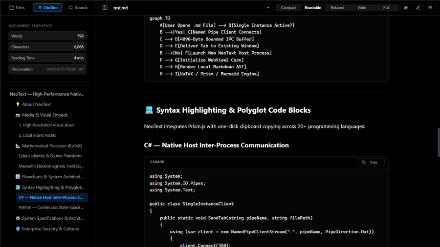
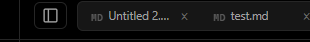
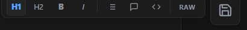
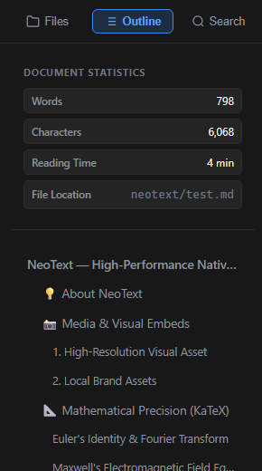
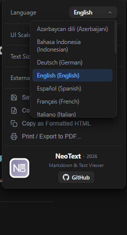

# Welcome to NeoText — Workspace & Interactive Guide

<div align="center">
  
  <p><strong>Lightweight, Native Windows 11 Fluent Markdown & Technical Document Workspace</strong></p>
  <p><em>100% Offline-First • Zero CDN Dependencies • Ultra-Fast Native Host (~20 MB RAM)</em></p>
</div>

---

## 💡 About NeoText

**NeoText** is an ultra-fast, native Windows document viewer and editor designed with an **engineering system-modeling discipline** to provide a clean, distraction-free reading and writing environment:

- ⚡ **Instant Launch:** Native WinForms host initializes Microsoft Edge WebView2 in under ~180 ms.
- 🍃 **Minimal Resource Footprint:** Operates on ~15-25 MB of RAM during typical documentation workflows.
- 🛡️ **Hardened Multi-Layer Security:** AST HTML sanitization, bounded IPC buffers, and protocol whitelisting.
- 📐 **Subpixel Mathematical Precision:** Bundled local KaTeX math typesetting and vector rendering.

<div align="center" style="margin: 20px 0;">
  
  <p><em>The NeoText Environment: Fluent Windows typography with distraction-free layout.</em></p>
</div>

---

## 🚀 Quick Start & Interactive User Guide

### 1. Document Reading & Visual Layouts

Customize your reading experience using the controls in the top-right header:

<div align="center" style="margin: 16px 0;">
  
  <p><em>Header toolbar: One-click reading width presets, theme switcher, and in-place editor.</em></p>
</div>

- **Reading Width Selector (Top Header):**
  - **Compact (600px):** Ultra-concentrated column for rapid scanning.
  - **Readable (760px) [Default]:** Scientifically optimal line length (~65–75 characters per line) to prevent eye fatigue.
  - **Relaxed (980px):** Balanced layout for documents containing diagrams and tables.
  - **Wide (1240px):** Expansive canvas for multi-column tables and code snippets.
  - **Full (100%):** Borderless edge-to-edge view utilizing your entire monitor width.
- **Theme Switcher (`Alt + Shift + T` or Header Icon):**
  - **Dark Mode:** Windows 11 Fluent anthracite palette (`#1c1c1c`).
  - **OLED Mode:** Pure pitch-black background (`#000000`) for OLED panels and maximum battery life.
  - **Light Mode:** Crisp, high-contrast daylight paper aesthetic.
  - *Native Windows Title Bar Synchronization:* Title bar, borders, and caption buttons dynamically sync with your active theme using Windows DWM API.

<div align="center" style="margin: 16px 0; display: flex; gap: 12px; justify-content: center; flex-wrap: wrap;">
  
  
</div>
<div align="center">
  <p><em>High-contrast themes: Daylight Paper Mode (left) and OLED Pure Black Mode (right).</em></p>
</div>

---

### 2. Multi-Tab Workspace & Window Management

NeoText includes a high-performance tabbed workflow integrated into the window title strip:

<div align="center" style="margin: 16px 0;">
  
  <p><em>Multi-Tab Strip: Embedded document tabs with drag-and-drop reordering and window tear-off.</em></p>
</div>

- **Tab Operations:**
  - **New Document:** Press `Ctrl + N` or `Ctrl + T` (or click `+` in header) to create a scratchpad document.
  - **Close Tab:** Press `Ctrl + W` (or click `×` on any tab).
  - **Switch Tabs:** Press `Ctrl + Tab` or `Ctrl + Shift + Tab`.
  - **Drag-and-Drop Reordering:** Click and drag any tab horizontally to rearrange your workspace.
  - **Window Tear-Off:** Drag a tab outside the window to detach it into an independent, floating NeoText window.
  - **Overflow Navigation:** When many tabs are open, use the left (`<`) and right (`>`) scroll arrows, horizontal mouse wheel scroll, or click the tabs dropdown (`▼`) to search and jump to any open tab.
- **External File Behavior:** In the Options menu (`⋮`), configure whether opening files from File Explorer opens them as a **New Tab** or in a **New Window**.
- **Unsaved Changes Guard:** Closing a modified tab or exiting the application prompts a safety dialog to Save, Discard, or Cancel.

---

### 3. In-Place Editing Mode (`Ctrl + E`)

Click the pencil icon in the top header or press `Ctrl + E` to toggle live editing mode:

<div align="center" style="margin: 16px 0;">
  
  <p><em>In-Place Edit Toolbar: Quick formatting tools, RAW mode toggle, and floating save button.</em></p>
</div>

- **Floating Formatting Toolbar:**
  - **Headings:** Heading 1 (`Ctrl + 1`), Heading 2 (`Ctrl + 2`).
  - **Inline Styles:** Bold (`Ctrl + B`), Italic (`Ctrl + I`).
  - **Lists:** Bulleted list with sub-menu options for Dash (`—`), Dot (`•`), or Numbered (`1.`).
  - **Quotes & Code Blocks:** One-click blockquote and pre-formatted code block insertion.
  - **RAW Editor:** Click **RAW** on the toolbar to switch between WYSIWYG rendered editing and the raw Markdown source code editor.
- **Saving Your Work:** Press `Ctrl + S` or click the floating save button in the bottom right corner. A confirmation toast will notify you of the successful save.
- **Clipboard Image Pasting (`Ctrl + V`):** Copy an image from anywhere (web, screenshot tool, Paint) and press `Ctrl + V` in edit mode. NeoText automatically saves the image as a local PNG in your document's folder and inserts the clean Markdown syntax ``.
- **Seamless Plain Text (.txt) Editing:** TXT files open in a full-height, borderless editor with an electric blue caret. Click anywhere on the viewport to place your cursor and start typing.

---

### 4. Collapsible Left Sidebar (`Alt + Shift + B`)

Click the sidebar icon in the top-left or press `Alt + Shift + B` to toggle the navigation panel:

<div align="center" style="margin: 16px 0;">
  
  <p><em>Collapsible Sidebar: Workspace folder tree, document statistics, and ScrollSpy Table of Contents.</em></p>
</div>

- 📁 **Files / Workspace Tree:**
  - Browse your active folder, expand subdirectories, and open documents.
  - Use **Select Folder** to set your project workspace (defaults to Desktop on clean launch).
  - Built-in `FileSystemWatcher` auto-refreshes the tree when files are created, renamed, or deleted.
- 📑 **Outline & Real-Time Document Statistics:**
  - **Live Metrics:** Word count, character count, estimated reading time, and full file path.
  - **Interactive Table of Contents (TOC):** Click any heading (H1–H6) to smoothly jump to that section.
  - **ScrollSpy:** The outline highlights your current reading position as you scroll through the document.
- 🔍 **In-Document Search (`Ctrl + F`):**
  - Instant text search across the active document with real-time match counter.
  - Navigate matches with `Enter` (Next) and `Shift + Enter` (Previous).
  - Click any search snippet in the sidebar list to jump directly to that occurrence.

---

### 5. Options Menu & Document Tools (Top-Right `⋮`)

Access the main options dropdown by clicking the three-dots icon in the top-right:

<div align="center" style="margin: 16px 0;">
  
  <p><em>Options Dropdown: 20-language localized selector, UI zoom sliders, and quick export utilities.</em></p>
</div>

- 🌐 **20 Languages Localization:** Full native interface translation in English, Turkish, German, French, Spanish, Italian, Portuguese, Dutch, Polish, Russian, Ukrainian, Arabic, Hindi, Japanese, Chinese (Simplified & Traditional), Korean, Vietnamese, Indonesian, and Azerbaijani. Automatically matches your Windows display language.
- 🔍 **UI Scaling & Typography Size:** Independently adjust UI Scale (80% to 150%) and Text Font Size (12px to 24px) to match your monitor and eyesight.
- 💾 **Save As... (`Ctrl + Shift + S`):** Save a copy of your document with custom formatting.
- 🔄 **Document Conversion:**
  - Convert Markdown (.md) to clean plain text (.txt).
  - Convert Plain Text (.txt) to Markdown (.md).
- 📋 **Copy as Formatted HTML:** Copies rendered HTML markup to Windows clipboard for pasting into emails, web editors, or Word.
- 🖨️ **Print & PDF Export (`Ctrl + P`):** Print your document or save it as a high-quality PDF using dedicated print CSS styles.

---

## ⌨️ Keyboard Shortcuts Cheat Sheet

| Category | Shortcut | Description |
| :--- | :--- | :--- |
| **Workspace** | `Ctrl + N` / `Ctrl + T` | Create new scratchpad document |
| **Workspace** | `Ctrl + W` | Close active document tab |
| **Workspace** | `Ctrl + Tab` | Switch to next open tab |
| **Workspace** | `Ctrl + Shift + Tab` | Switch to previous open tab |
| **Navigation** | `Alt + Shift + B` | Toggle left navigation sidebar |
| **Search** | `Ctrl + F` | Focus in-document search box |
| **Search** | `Enter` / `Shift + Enter` | Jump to next / previous search match |
| **View** | `Alt + Shift + T` | Cycle theme (Dark ➔ OLED ➔ Light) |
| **Edit Mode** | `Ctrl + E` | Toggle Edit Mode on/off |
| **Editing** | `Ctrl + S` | Save active document changes |
| **Editing** | `Ctrl + V` | Paste image from clipboard as local file |
| **Formatting** | `Ctrl + 1` / `Ctrl + 2` | Heading 1 / Heading 2 |
| **Formatting** | `Ctrl + B` / `Ctrl + I` | Bold / Italic text |
| **Export** | `Ctrl + Shift + S` | Save As (open native save dialog) |
| **Export** | `Ctrl + P` | Print or export document to PDF |

---

## 📸 Media & Visual Embeds

NeoText effortlessly handles high-resolution web graphics as well as local application assets with automatic offline fallback:

### 1. High-Resolution Visual Asset

*Example: Ultra-wide landscape photography dynamically loaded with crisp typography.*

### 2. Local Brand Assets
<div align="center">
  
  <p><em>Bundled Geometric Vector Icon (Assets Directory)</em></p>
</div>

---

## 📐 Mathematical Precision (KaTeX)

NeoText bundles all mathematical fonts and the KaTeX engine locally. No internet connection is ever required to render complex LaTeX formulas:

### Euler's Identity & Fourier Transform
$$e^{i\pi} + 1 = 0 \quad \Longleftrightarrow \quad \mathcal{F}\left\{ \frac{d^n x(t)}{dt^n} \right\} = (i\omega)^n X(\omega)$$

### Maxwell's Electromagnetic Field Equations
$$\oint\limits_{\partial \Sigma} \mathbf{B} \cdot d\mathbf{l} = \mu_0 \iint\limits_{\Sigma} \mathbf{J} \cdot d\mathbf{A} + \mu_0 \varepsilon_0 \frac{d}{dt}\iint\limits_{\Sigma} \mathbf{E} \cdot d\mathbf{A}$$

$$\nabla \times \mathbf{E} = -\frac{\partial \mathbf{B}}{\partial t}, \quad \nabla \cdot \mathbf{B} = 0$$

---

## 💻 Syntax Highlighting & Polyglot Code Blocks

NeoText integrates Prism.js with one-click clipboard copying across 20+ programming languages:

### C# — Native Host Inter-Process Communication
```csharp
using System;
using System.IO.Pipes;
using System.Text;

public class SingleInstanceClient
{
    public static void SendTab(string pipeName, string filePath)
    {
        using (var client = new NamedPipeClientStream(".", pipeName, PipeDirection.Out))
        {
            client.Connect(350);
            byte[] data = Encoding.UTF8.GetBytes("OPEN_TAB:" + filePath);
            client.Write(data, 0, Math.Min(data.Length, 4096));
        }
    }
}
```

### Python — Continuous State-Space Response
```python
import numpy as np
from scipy.linalg import expm

def solve_linear_system(A, B, u0, x0, t):
    """Computes exact continuous-time state vector trajectory."""
    state_transition = expm(A * t)
    return state_transition @ x0
```

---

## ⚙️ System Specifications & Architecture

| Architecture Parameter | Specification | Notes |
| :--- | :--- | :--- |
| **Native Windows Host** | C# WinForms (.NET Framework 4.5+) | Pure native binary compiled with `csc.exe` |
| **Rendering Subsystem** | Microsoft Edge WebView2 | Evergreen Chromium rendering core |
| **Startup Latency** | ~180 ms | Sub-200ms warm and cold initialization |
| **Memory Footprint** | ~15 – 25 MB RAM | Highly optimized memory consumption |
| **Window Management** | Multi-Tab & Tear-Off Processes | Independent OS processes per torn window |
| **Asset Delivery** | 100% Offline (Zero CDN) | KaTeX, Prism, and fonts bundled locally |
| **Large File Protection** | >2 MB Safety Guard | Switches to optimized pre-viewer to avoid freezes |

---

## 🛡️ Enterprise Security & Callout Showcase

> [!NOTE]
> **Zero External Telemetry:** NeoText does not make outbound network requests, ping telemetry servers, or send analytics. Your technical documents stay strictly on your local disk.

> [!TIP]
> **Clipboard Image Paste:** While editing in Edit Mode (`Ctrl+E`), simply press `Ctrl+V` to paste an image from your clipboard. NeoText automatically saves the PNG file into your workspace and inserts clean Markdown syntax!

> [!IMPORTANT]
> **AST DOM Cleaner:** Every rendered HTML node passes through an aggressive client-side sanitizer that eliminates 100% of `<script>`, `<iframe>`, inline `onload`/`onerror`, and `javascript:` URIs.

> [!WARNING]
> **Live File Watching:** When an open document is modified by an external editor (VS Code, Notepad, Git pull), `FileSystemWatcher` automatically refreshes the viewport seamlessly.

> [!CAUTION]
> **Large File Safety Guard:** Documents exceeding 2 MB automatically switch to the lightweight raw text viewer to preserve system responsiveness.
