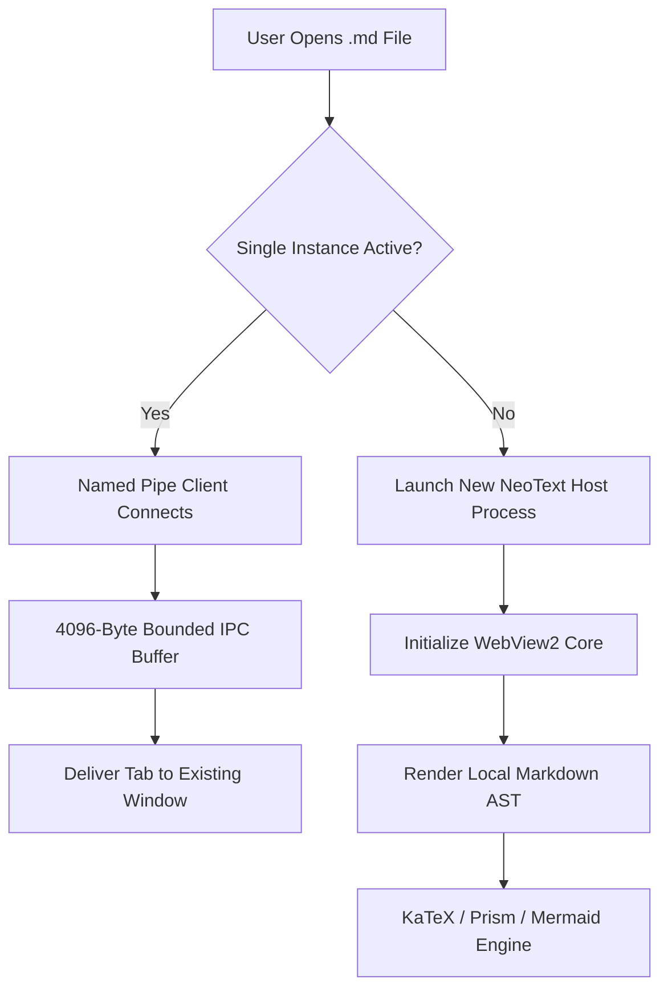

# NeoText — High-Performance Native Markdown Workspace

<div align="center">
  
  <p><strong>Lightweight, Native Windows 11 Fluent Markdown & Technical Document Workspace</strong></p>
  <p><em>100% Offline-First • Zero CDN Dependencies • Ultra-Fast Native Host (~20 MB RAM)</em></p>
</div>

---

## 💡 About NeoText

**NeoText** is an ultra-fast, native Windows document viewer and editor designed with an **engineering system-modeling discipline** to provide a clean, distraction-free reading and writing environment:

- ⚡ **Instant Launch:** Native WinForms host initializes Microsoft Edge WebView2 in under ~180 ms.
- 🍃 **Minimal Resource Footprint:** Operates on ~15-25 MB of RAM during typical documentation workflows.
- 🛡️ **Hardened Multi-Layer Security:** AST HTML sanitization, bounded IPC buffers, and protocol whitelisting.
- 📐 **Subpixel Mathematical Precision:** Bundled local KaTeX math typesetting and vector-rendered Mermaid diagrams.

---

## 📸 Media & Visual Embeds

NeoText effortlessly handles high-resolution web graphics as well as local application assets with automatic offline fallback:

### 1. High-Resolution Visual Asset

*Example: Ultra-wide landscape photography dynamically loaded with crisp typography.*

### 2. Local Brand Assets
<div align="center">
  
  <p><em>Bundled Geometric Vector Icon (Assets Directory)</em></p>
</div>

> [!TIP]
> **Clipboard Image Paste:** While editing in Edit Mode (`Ctrl+E`), simply press `Ctrl+V` to paste an image from your clipboard. NeoText automatically saves the PNG file into your workspace and inserts clean Markdown syntax!

---

## 📐 Mathematical Precision (KaTeX)

NeoText bundles all mathematical fonts and the KaTeX engine locally. No internet connection is ever required to render complex LaTeX formulas:

### Euler's Identity & Fourier Transform
$$e^{i\pi} + 1 = 0 \quad \Longleftrightarrow \quad \mathcal{F}\left\{ \frac{d^n x(t)}{dt^n} \right\} = (i\omega)^n X(\omega)$$

### Maxwell's Electromagnetic Field Equations
$$\oint_{\partial \Sigma} \mathbf{B} \cdot d\mathbf{l} = \mu_0 \iint_{\Sigma} \mathbf{J} \cdot d\mathbf{A} + \mu_0 \varepsilon_0 \frac{d}{dt}\iint_{\Sigma} \mathbf{E} \cdot d\mathbf{A}$$

$$\nabla \times \mathbf{E} = -\frac{\partial \mathbf{B}}{\partial t}, \quad \nabla \cdot \mathbf{B} = 0$$

---

## 📊 Flowcharts & System Architecture (Mermaid.js)

Complex system graphs, sequence diagrams, and class hierarchies are rendered into crisp SVG vectors:



---

## 💻 Syntax Highlighting & Polyglot Code Blocks

NeoText integrates Prism.js with one-click clipboard copying across 20+ programming languages:

### C# — Native Host Inter-Process Communication
```csharp
using System;
using System.IO.Pipes;
using System.Text;

public class SingleInstanceClient
{
    public static void SendTab(string pipeName, string filePath)
    {
        using (var client = new NamedPipeClientStream(".", pipeName, PipeDirection.Out))
        {
            client.Connect(350);
            byte[] data = Encoding.UTF8.GetBytes("OPEN_TAB:" + filePath);
            client.Write(data, 0, Math.Min(data.Length, 4096));
        }
    }
}
```

### Python — Continuous State-Space Response
```python
import numpy as np
from scipy.linalg import expm

def solve_linear_system(A, B, u0, x0, t):
    """Computes exact continuous-time state vector trajectory."""
    state_transition = expm(A * t)
    return state_transition @ x0
```

---

## ⚙️ System Specifications & Architecture

| Architecture Parameter | Specification | Notes |
| :--- | :--- | :--- |
| **Native Windows Host** | C# WinForms (.NET Framework 4.5+) | Pure native binary compiled with `csc.exe` |
| **Rendering Subsystem** | Microsoft Edge WebView2 | Evergreen Chromium rendering core |
| **Startup Latency** | ~180 ms | Sub-200ms warm and cold initialization |
| **Memory Footprint** | ~15 – 25 MB RAM | Highly optimized memory consumption |
| **Window Management** | Multi-Tab & Tear-Off Processes | Independent OS processes per torn window |
| **Asset Delivery** | 100% Offline (Zero CDN) | KaTeX, Prism, Mermaid, and fonts bundled locally |
| **Large File Protection** | >2 MB Safety Guard | Switches to optimized pre-viewer to avoid freezes |

---

## 🛡️ Enterprise Security & Callouts

> [!NOTE]
> **Zero External Telemetry:** NeoText does not make outbound network requests, ping telemetry servers, or send analytics. Your technical documents stay strictly on your local disk.

> [!TIP]
> **Keyboard Productivity Shortcuts:**
> - `Ctrl + Tab`: Cycle forward through open workspace tabs
> - `Ctrl + W`: Close active tab
> - `Ctrl + N`: Create a new scratchpad document
> - `Alt + Shift + B`: Toggle collapsible left sidebar
> - `Alt + Shift + T`: Cycle Dark, OLED Black, and Light themes

> [!IMPORTANT]
> **AST DOM Cleaner:** Every rendered HTML node passes through an aggressive client-side sanitizer that eliminates 100% of `<script>`, `<iframe>`, inline `onload`/`onerror`, and `javascript:` URIs.

> [!WARNING]
> **Live File Watching:** When an open document is modified by an external editor (VS Code, Notepad, Git pull), `FileSystemWatcher` automatically refreshes the viewport seamlessly.

> [!CAUTION]
> **Large File Safety Guard:** Documents exceeding 2 MB automatically switch to the lightweight raw text viewer to preserve system responsiveness.
